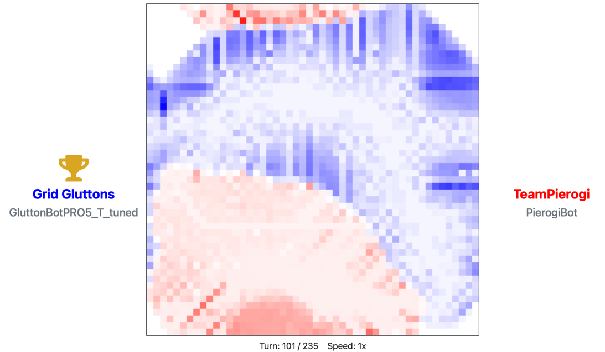
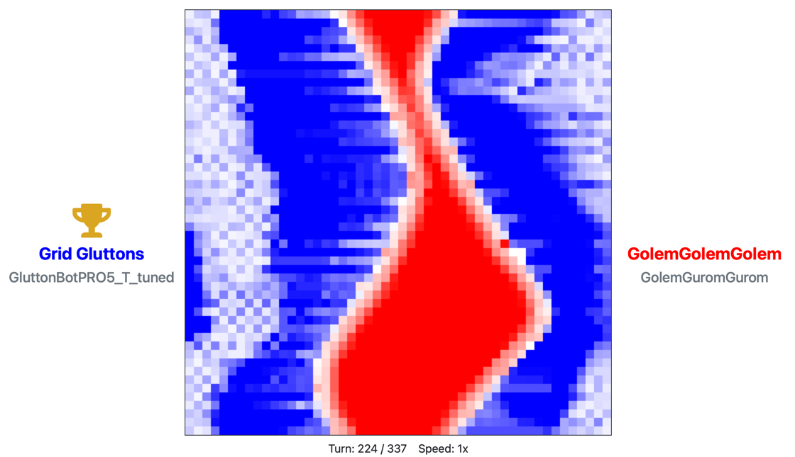

# GridWars Hackathon 
### CERN Winter Campus 2022, AGH UST, Cracow
The winning program of the 2022 edition of the CERN GridWars Hackathon.

## Idea
In order to win the game we used several techniques. We prepared two separate strategies: 
- to cover most of the map and gain as many units as it is possible,
- to attack the enemy.

Another important thing was to find optimal parameters for our algorithm. 
We created a GUI-less simulator and then used GridSearch to find the parameters.
Before this optimization, our bot was only in the top 3.

**Fun fact:** We ran over 100.000 games to find the best parameters. It took a whole night to do that.

Our algorithm also uses some graph algorithms, mostly BFS, and its combinations.

## Ranking

Unfortunately, the screenshot was made several weeks after the competition. Originally, it had 2 losses.

## Screenshots
**Game with 2nd place bot**

TeamPierogi, guys from Jagiellonian University :) 




**Game with 3rd place bot**

GolemGolemGolem, guys from Warsaw University of Technology :)


---

# Using project
## GridWars Starter Project

This starter project provides everything to get you going with the development of your own bot for the GridWars coding competition.

Please refer to the [getting started page](https://gridwars.cern.ch/docs/getting-started) available online for a comprehensive guide. You can also refer to the PDF slides shipped in this starter project that explains the game mechanics and some rules.

### Project Content

| Content        | Description |
|----------------|-------------|
| `build.gradle` | Gradle build config file. You need to configure the class name of your bot here. |
| `/src/`        | Source code to run the emulator and two simple example bots. |
| `/slides/`     | Slides of the GridWars intro session. |
| `/docs/`       | JavaDocs of the GridWars API classes. Open the `index.html` in a browser. |
| `/lib/`        | GridWars API and the emulator Java libs (no need to touch). |
| `/build/`      | Automatically generated, used for build output. |
| `gradlew`      | Gradle wrapper executable for Linux and Mac (no need to touch). |
| `gradlew.bat`  | Gradle wrapper executable for Windows (no need to touch). |
| `/gradle/`     | Gradle wrapper files (no need to touch). |

### Run the emulator

To run the GridWars emulator, execute the `run` Gradle task in the IDE. The output of the bots will be logged to the files `bot1.log` and `bot2.log` in the project root folder.

Modify the `gridwars.starter.EmulatorRunner` class to define what bot classes are used to have your own bot fight with another bot. This can either be one of the provided example bots to get started, or other versions of your own bot to compare them and see, which version is the strongest.

To run the emulator you can execute the Gradle `run` command from the IDE or from the console:

**Linux/Mac:** `./gradlew run`

**Windows:** `gradlew.bat run`

### Create the uploadable bot jar file

Once you have created your own bot, you first need to fill in the fully qualified class name of your bot in the `build.gradle` file to be used for the `Bot-Class-Name` manifest header. For example:

```
manifest {
    attributes( 
        'Bot-Class-Name': 'gridwars.starter.MyAwesomeBot'
    )
}
```

Then execute the `jar` Gradle task in the IDE or from the console:

**Linux/Mac:** `./gradlew jar`

**Windows:** `gradlew.bat jar`

The resulting bot jar file will be located at `<project root>/build/libs/gridwars-bot.jar`.

Finally, visit your [team page](https://gridwars.cern.ch/team) and upload the bot and see how it competes. Good luck and have fun!

Play fair... and may the code be with you ;)

<pre>
                                    _.=+._
 \::::::::::::::::::::::::::.\`--._/[_/~|;\_.--'/.:::::::::\
  \::::::::::::::::::::::::::.`.  ` __`\.-.(  .'.:::::::::::\
  /::::::::::::::::::::::::::::.`-:.`'..`-'/\'.:::::::::::::/
 /::::::::::::::::::::::::::::::::.\ `--')/  ) ::::::::::::/
                                     `--'
</pre>
